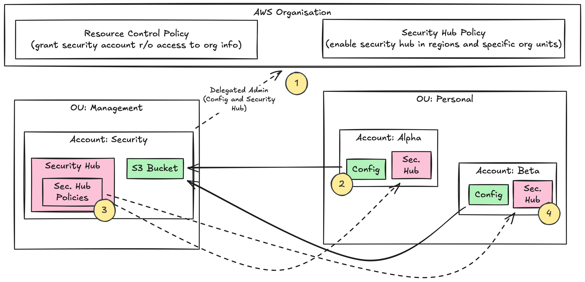
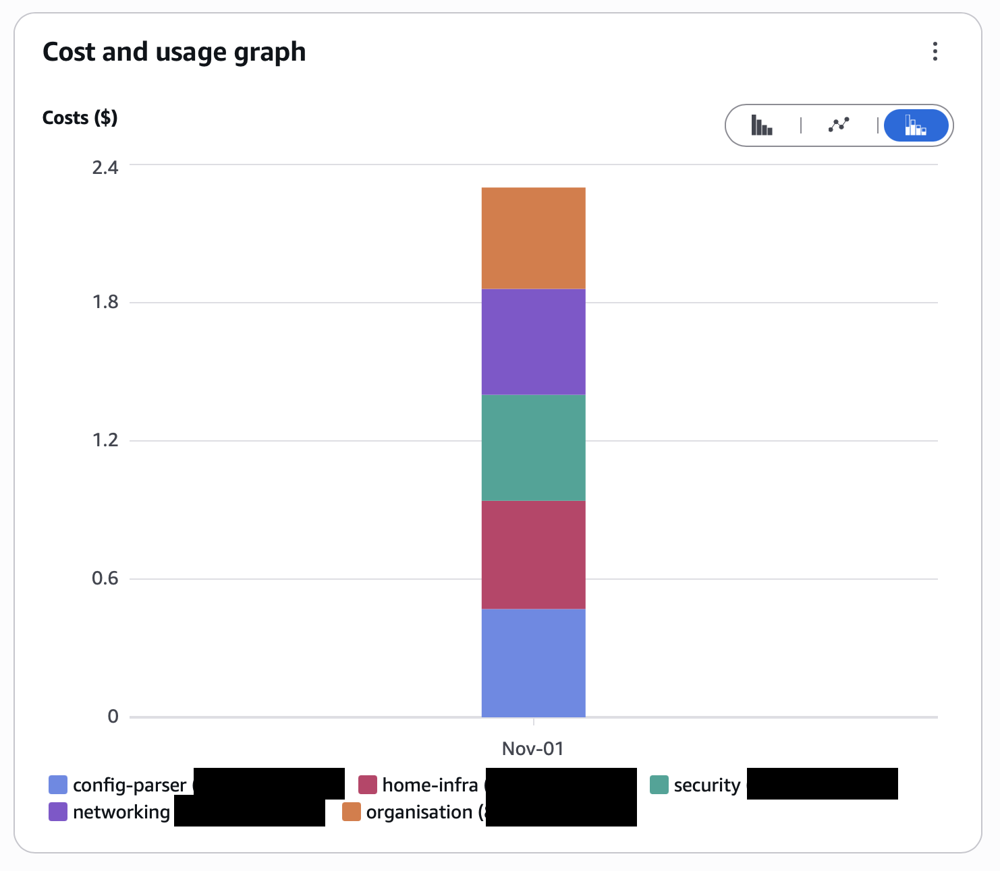
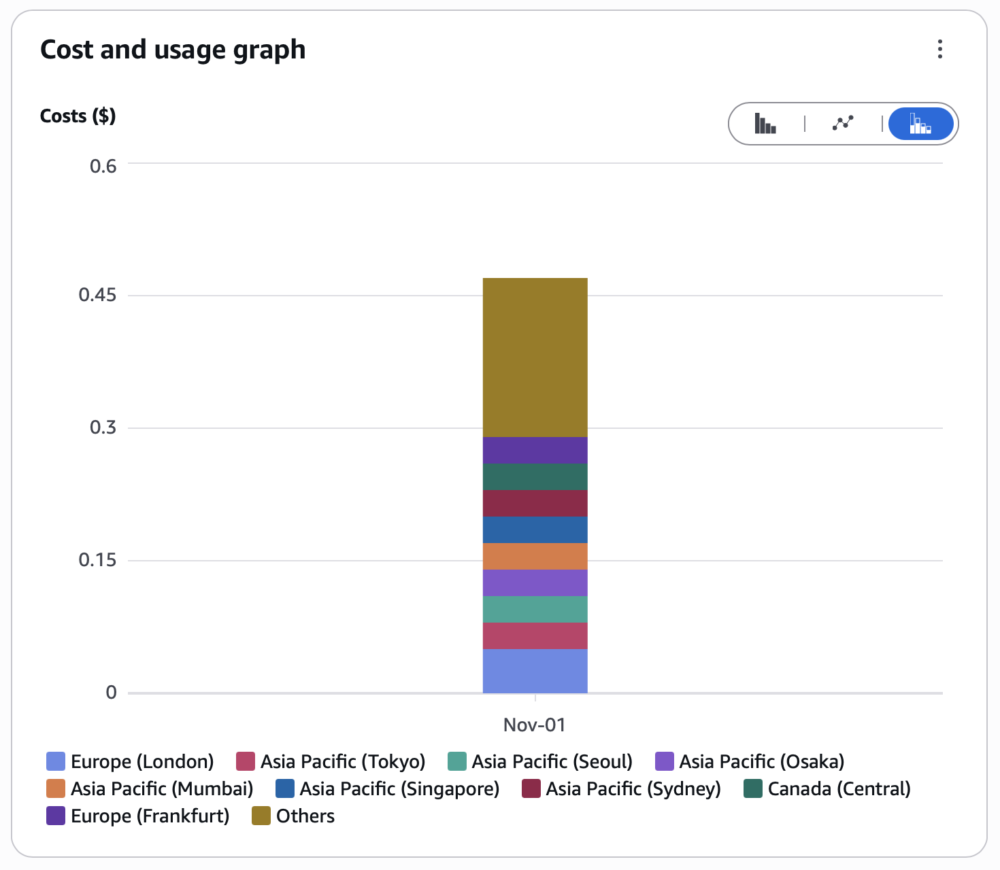

+++
title = "AWS Security Hub in AWS Organisations (2025)"
date = "2025-12-04"
author = "Ryan Missett"
summary = "Exploring how AWS Security integrates with AWS Organisations across multiple regions and member accounts in 2025."
+++

_NB. a note on terminology- as of late 2025, the set of features that people think of as Security Hub has been renamed to Security Hub CSPM (cloud security posture management). The thing that is now simply Security Hub is actually an umbrella service that aggregates results from CSPM, GuardDuty, Inspector and Macie._

_I can see the logic behind wanting a central place for all your security findings, but the choice to go in this particular direction with the name is asinine in my opinion. For the purposes of this article, when I refer to Security Hub, I'm referring specifically to the functionality and the service that is now CSPM._

When I spin up a side project in my spare time, I like to put it in its own AWS account, separate from everything else I've done before. The virtues of account-level segregation are well known and understood at this point, so I won't dig into that here. To keep my accounts nice and organised, I manage all this via my own custom AWS Landing Zone, that configures a greatly simplified version of the [AWS Security Reference Architecture](https://docs.aws.amazon.com/prescriptive-guidance/latest/security-reference-architecture/architecture.html). I can run a GitHub Actions pipeline and vend a new account in my organisation with a safe and secure baseline config applied to it. 

This works very nicely for me, but I have quite a few accounts now (most of which cost me $0 per month) and making sure I've done all the right things like disable S3 public access everywhere can be a challenge. To make sure I stay on top of these security practises across all my accounts, I tried configuring Security Hub across my Organisation recently. Security standards like CIS can serve as a useful checklist of best practises, so the thought of having Security Hub tell me what I need to do across all the accounts in my Organisation seemed very appealing to me. 

What follows here is meant to be a summary of how I ended up implementing Security Hub across my (very small) Organistion. The documentation for Security Hub is long and winding, and tries to cater for a dozen different use-cases. It might be that I've misunderstood things, but here's where I've landed on my implementation. Whilst trying to do this, my main goals were

- Implemented in Terraform, with no ClickOps. Concerningly many of the Terraform resources related to Security Hub have notes about being able to 'enable' things, but not 'disable' things, so something to watch out for.
- I have a dedicated Security account that should serve to aggregate Security Hub findings for every account in my Organisation. This is known as the Delegated Administrator.
- Costs should be minimal of course. I go through fits and starts with my side projects, so I can't really justify a significant monthly cost for this. Lets say a dollar or two per account per month, on the theory that it's better to pay this now than foot the bill for a compromised account later on.

## Starting Out

Let's do a little sketch of what my environment looks like, and how Security Hub works across the Organisation.



1. The Organisation management account is configured with a Resource Control Policy and a Security Hub Policy. The RCP grants our designated Security account access to Org information so it can inspect different OUs and Accounts. It can also attach policies at different points in the hierarchy. The Security Hub Policy is a newer type of Organisation Policy, and enables Security Hub for specific regions (or all enabled regions). Different OUs can have different Security Hub Policies attached, so you could enable Security Hub in your production OU, but not in your sandbox OU.

2. AWS Config is a key service in our Security Hub implementation. Without it, nothing will work in Security Hub. AWS Config reports account resource configs back to the designated security account and stores these reports in an S3 bucket. AWS Config is managed in my Organisation via my 'account baseline', which is the config that I must push out to all my member accounts myself (via Terraform and GitHub pipelines specifically). This is in contrast with Security Hub, where the member accounts have Security Hub enabled centrally, from the management account. 

3. The security account creates Security Hub Config Policies and attaches them to OUs in the organisation. These are probably the most interesting bit, as they specify the security controls you want to monitor for. There are predefined config sets such as CISv1.4, PCI DSS etc. The Config Policies will cause Config rules to be created in member accounts to which the policy applies. Again, the rules will be created in every enabled region.

4. These Config controls will continually evaluate against your deployed resources. Resource configs and rule evaluation results can either be collected continually, every few hours, or daily, depending on your use case. For my personal projects, it was enough to enable it daily. This really helps with keeping the costs down to pennies per day. The results of rule evaluations are reported back to the security account. The region where you enabled Security Hub in the security account can have an aggregator configured, so it will show you results for all your member accounts from all enabled regions in one place. 

## Costs

Any chat about Security Hub and Config isn't done until we talk costs. It has a sometimes well-earned reputation for spiking costs unexpectedly and then being hard to find the 'off button' for it all. I will definitely vouch for that being the case. It doesn't help that as of late-2025 AWS is offering a trial period for what is now CSPM. You can get everything set up, and have no idea of what it will cost to run until you're well into implementation. Fine for big orgs, sure, but not fine for my personal projects. 

After my trial period ended my AWS bill shot to approximately $80 for the month. So I went to delete the Terraform code I'd used to configure everything. That's what's so great about Terraform, right? If you want to switch something off, you just delete the resources from the source code and run 'apply'. Well, sure. Only in this case, deleting the resources from your correctly-enabled central Security Hub config doesn't actually switch everything off across your member accounts. The Config rules don't get deleted from your member accounts, Security Hub stays enabled within them all too. 

__To switch everything off, you must explicitly disable Security Hub in your member accounts, and crucially you must also disable it in every _region_ in that member account too! Before you can disable Security Hub in your member account you must first disassociate it from your central management configuration. I put together this very simple script to disable everything in my organisation. Just configure the list variables at the top with your profiles and account IDs.__

```bash
DELEGATED_SECURITY_ACCOUNT_ID=""
ORG_ADMIN_PROFILE=""
SECURITY_ADMIN_PROFILE=""
REGIONS="ap-northeast-1 ap-northeast-2 ap-northeast-3 ap-southeast-1 ap-southeast-2  ap-south-1 ca-central-1  eu-central-1 eu-north-1 eu-west-2 eu-west-1 eu-west-3  sa-east-1  us-east-1 us-east-2 us-west-1 us-west-2"
RW_PROFILES=""
ACCOUNTS=""

# First disassociate members from the organisation.
for region in $REGIONS; do
  for account in $ACCOUNTS; do
    aws --profile $SECURITY_ADMIN_PROFILE --region "$region" \
        securityhub disassociate-members --account-ids "$account"
  done
done

# Disable the central admin in the security account.
aws securityhub disable-organization-admin-account \
      --admin-account-id "$DELEGATED_SECURITY_ACCOUNT_ID" \
      --profile "$ORG_ADMIN_PROFILE" \
      --region "eu-west-2"

# Now each account is independent, iterate over each region and each account, and switch security hub off.
for region in $REGIONS; do
  for profile in $RW_PROFILES; do
    account=$(echo $profile | sed -e 's/[a-zA-Z_]//g')

    echo "--- $region - $account ---"

    status=$(aws securityhub describe-hub --profile "$profile" --region "$region" 2>&1 | head -3)

    if echo "$status" | grep -q "InvalidAccessException"; then
      echo "✓ $region-$account: DISABLED"
    else
      echo "✗ $region-$account: DISABLING..."
      aws securityhub disable-security-hub --profile "$profile" --region "$region"
    fi
  done
done
```

If you're in the situation I just described- trying to find where your Security Hub costs are coming from and getting frustrated, I'll show you how to use your billing info to narrow down the search.



Here's the first step, see which accounts your security hub charges are coming from by setting the dimension to Linked Account. You can see each of my member accounts are generating the same security hub costs. That's a good sign that Security Hub is still enabled in these, even after deleting all my Org-level Security Hub config. 

Now let's choose one member account, and set the dimension to 'region' and make sure the 'service' filter is still set to Security Hub.



Okay that looks like we have charges coming from every enabled region in my organisation. Security Hub is definitely running in every region, so we just need to switch it off in all those regions. This billing view helped me track everything down and get my costs back under control. You can see that I've obviously applied some policy at some point that enabled Security Hub in every region for all my member accounts, and deleting those policies hasn't also deleted the Security Hub config in those regions and accounts.

Once I've got all that ironed out, and Security Hub is enabled only in the regions I actually need, costs have come down significantly. It's actually quite manageable for my budget to have Security Hub enabled in one region for five accounts. The budget for one region in one account with CISv1.4 enabled in those accounts is $0.03 per day. 

## Summary

The key takeaway from all this is that yes, it's easy to blow through your budget with Security Hub. But it's also possible to deploy it in a very focussed way to only the regions you care about. Amazon doesn't make it easy to find out how to do this, but it's very possible with a bit of effort. 

I've also seen a lot of people saying that AWS Config is very expensive. I can't say that's my experience at all. I've consciously set Config to only record resources on a daily basis, rather than continuously. Security Hub findings are still aggregated in real time, but Config recordings happen once per day. This definitely helps to keep charges to a minimum.

I've found these settings work really well for me. Having a minimal policy enabled like CIS helps make sure I've done all the basics right, eg. making sure I've got S3 public access blocks everywhere. I don't need total regional coverage, as I tend to restrict my efforts to just eu-west-2, and I don't need constant recordings of my resource states. 

You might find that in your Organisation these settings aren't quite right for you, but it's worth thinking about whether or not you actually need to flip the 'activate everything' button on services like Security Hub, or whether you could do the fine tuning to get just the the benefits you actually need.
